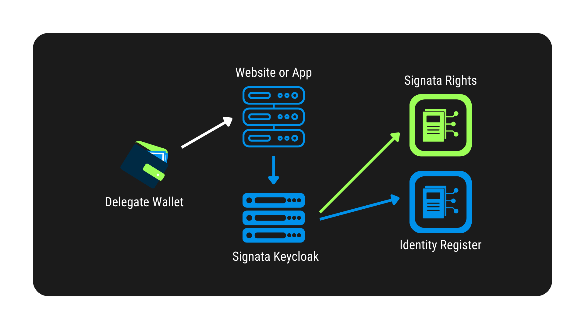

# Identity Provider Design

auth.signata.net

## Overview

<figure><figcaption></figcaption></figure>

## Authentication

## Authorization

## Integration

## Keycloak Configuration

### Create Realm

Click **Add Realm**.

 (1).png>)

Set the name to **Signata** and click **Create**.

 (2) (2).png>)

### Configure Authentication

Click **Authentication** in the left menu.

 (2).png>)

In Flows, click **New**.

.png>)

Set the Alias to **Signata** and click **Save**.

 (1).png>)

Click **Add execution**.

 (3).png>)

Select **Signata Signature** and click **Save**.

.png>)

Set the Signata Signature to **REQUIRED**. Under Actions click **Config**.

 (2).png>)

Set the Alias to **Signata**, the Infura Id and Node URLs to the keys provided by Infura. Set the Timeout to **120**. Click **Save**.

 (2).png>)

### Create Client

Click on **Clients** in the left menu.

 (1) (1).png>)

