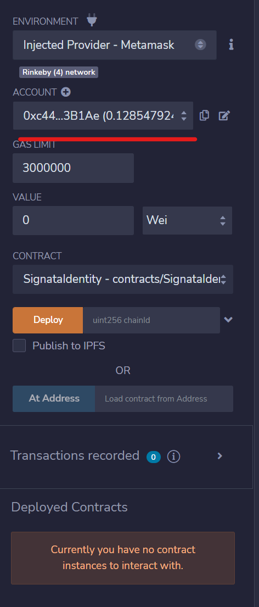

# Managing Identities

To access the Signata Identity Manager, use the following link:



## Wallet Identities

### Creating a Wallet Identity

In the **Add Identity** section, click on the **Wallet** tab.

<figure><figcaption></figcaption></figure>

Click **Generate** to randomly generate a new set of Identity seeds. The delegate for your identity will be your connected wallet. Click **Add Identity**.

<figure><figcaption></figcaption></figure>

Your wallet will pop up asking you for a Signature. **This is not a payment signature**, this signature just proves you control your wallet and will let you save your identity data to IPFS.

<figure><figcaption></figcaption></figure>

### Registering your Wallet Identity

Once an identity is created it needs to be **registered** on a blockchain to be usable.

<figure><figcaption></figcaption></figure>

Sign the request from your wallet to register the identity.


The wallet you have connected to your browser will pay for the transaction fees, and will link the creation of the identity to that wallet. If you're wanting to isolate your wallet on-chain, make sure you don't pay for transactions with the wrong connected wallet.


### Renaming a Wallet Identity


Identity names are just so you can easily identify which identity is which. The names are not visible to anyone else, and are not written to the blockchain.


In your identity, click **Rename**.

<figure><figcaption></figcaption></figure>

A confirmation window will appear. Specify your new identity name and click **Save New Name**.

<figure><figcaption></figcaption></figure>

### Deleting a Wallet Identity


Identities can only be deleted if they haven't been registered. Registering your identity writes it to the blockchain, and so you can destroy it on-chain but not delete it once it's registered.


Click **Delete** in the identity options.

<figure><figcaption></figcaption></figure>

A confirmation window will appear. Click **Delete Identity**.

<figure><figcaption></figcaption></figure>

### Locking a Wallet Identity

Click **Lock**.

<figure><figcaption></figcaption></figure>

A confirmation popup will appear. Click **Lock Identity**.

<figure><figcaption></figcaption></figure>

Confirm the signature request in your browser. Your wallet may show a warning about signing the message - this warning can be ignored.\

<figure><figcaption></figcaption></figure>

Once you have signed the message, confirm the transaction in your web3 wallet.

<figure><figcaption></figcaption></figure>

### Unlocking a Wallet Identity

Click **Unlock**.

<figure><figcaption></figcaption></figure>

A confirmation popup will appear. Click **Unlock Identity**.

<figure><figcaption></figcaption></figure>

Confirm the transaction in your web3 wallet.

<figure><figcaption></figcaption></figure>

